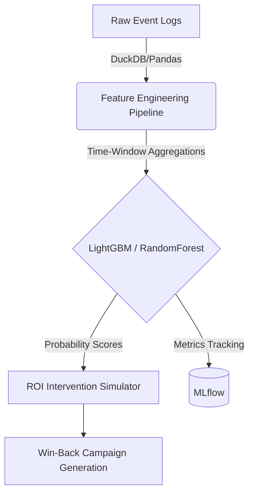

# E-Commerce Customer Retention Pipeline

A high-throughput machine learning system for predicting customer repurchase trajectories, identifying at-risk segments, and estimating the total ROI of targeted marketing interventions.

## Architecture & System Design



## Business Impact & Results

The pipeline focuses on non-contractual (Buy-Till-You-Die) customer relationships, predicting the likelihood of a next purchase within a configurable prediction window.

| Metric | Value | Business Interpretation |
|--------|-------|-------------------------|
| AUC-ROC | ~0.85 | Strong overall discrimination power between active and churning customers. |
| Precision @ 10% | ~65% | High confidence when targeting the top decile of the riskiest users. |
| Lift @ 10% | ~3.2x | Intervention targeting is >3x more effective than an unsegmented blast. |

**Key analytical findings:**

- The strongest predictor of non-repurchase is "Days since last activity" (Recency).
- Sudden deceleration in browsing velocity accurately predicts abandonment.
- Simulated intervention targeting the top 20% at-risk segment projected a **~600% ROI** given a standard Customer Lifetime Value (CLV) multiple.

---

## Technical Stack & MLOps

This repository is designed for reproducibility and scale, utilizing:

- **Modeling:** LightGBM, Random Forest, Logistic Regression
- **Experiment Tracking:** MLflow
- **Configuration & Validation:** Pydantic
- **Logging:** Loguru
- **Interpretability:** SHAP
- **Reproducibility:** Docker, Makefile

---

## Quickstart & Reproducibility

Prerequisites: Minimum Python 3.10 and Kaggle API credentials.

### Setup using Make

For local development:

```bash
git clone https://github.com/yourusername/ecommerce-retention-pipeline.git
cd ecommerce-retention-pipeline

# create virtualenv, install dependencies, pull dataset
make install
make data
```

### Setup using Docker

To run the pipeline in an isolated, production-ready container:

```bash
docker build -t ecommerce-retention .
docker run -it --rm -v $(pwd)/data:/app/data ecommerce-retention bash
```

---

## Dataset

Built against the RetailRocket Ecommerce Dataset, containing high-volume, event-driven behavior:

- **Events:** ~2.7M (Views, Add-to-Carts, Transactions)
- **Visitors:** 1.4M uniquely identified user sessions across 4.5 months.

Source: [Kaggle Dataset](https://www.kaggle.com/datasets/retailrocket/ecommerce-dataset)

---

## Usage Example

```python
from src.data_loader import DataLoader
from src.churn_definition import CustomerStateLabeler, StateWindows
from src.features import FeatureEngineer
from src.models import RetentionModel
from src.simulator import InterventionSimulator

# Download & Load
loader = DataLoader()
events = loader.load_events()

# Labeling states (Active vs. Inactive) via Buy-Till-You-Die heuristics
labeler = CustomerStateLabeler(windows=StateWindows(obs=60, gap=7, chk=30))
labels = labeler.label(events)

# Compute structured features
engineer = FeatureEngineer()
obs_events = labeler.obs_events(events, labels)
features = engineer.build_features(obs_events, labels)

# Train & Track via MLflow
model = RetentionModel(model_type="lightgbm", track_mlflow=True)
X, y = features.drop(columns=["visitorid"]), labels["churned"]
model.fit(X, y)

# Predict & Evaluate Interventions
probs = model.predict_proba(X)
sim = InterventionSimulator(ltv=100)
roi_analysis = sim.run(probs, threshold=0.5)

print(roi_analysis.summary())
```

## License

MIT
