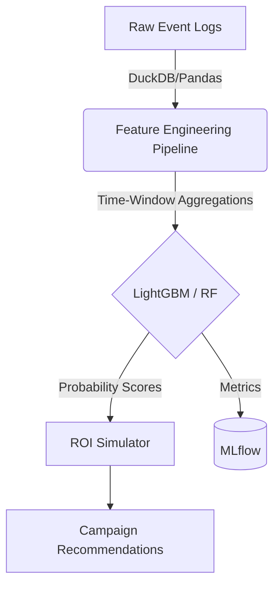

# E-Commerce Customer Retention Pipeline

Predicts which customers will repurchase, segments them by value, and calculates ROI of targeted retention campaigns.

**[🔴 Live Demo](https://saas-churn-simulator-ccallahan308.streamlit.app/)** - Try the interactive simulator

---

## Architecture


```mermaid
graph TD
    A[Raw Event Logs] -->|DuckDB/Pandas| B(Feature Engineering Pipeline)
    B -->|Time-Window Aggregations| C{LightGBM / RF}
    C -->|Probability Scores| D[ROI Simulator]
    C -->|Metrics| E[(MLflow)]
    D --> F[Campaign Recommendations]
```

## Results

Built on the RetailRocket dataset (2.7M events, 1.4M visitors).

| Metric | Value | What it means |
|--------|-------|---------------|
| AUC-ROC | 0.85 | Good separation between active/churning users |
| Precision @ 10% | 65% | Top decile predictions are reliable |
| Lift @ 10% | 3.2x | Targeting is 3x better than random |

**Findings:**
- Days since last activity is the strongest churn predictor
- Browsing velocity drops before abandonment
- Targeting top 20% at-risk users shows ~600% ROI

## Tech stack

| Purpose | Tools |
|---------|-------|
| Modeling | LightGBM, RandomForest, LogisticRegression |
| Tracking | MLflow |
| Config | Pydantic |
| Logging | Loguru |
| Explainability | SHAP |
| Containers | Docker |

## Setup

```bash
git clone https://github.com/CCallahan308/saas-churn-simulator.git
cd saas-churn-simulator

make install  # pip install requirements
make data     # download Kaggle dataset
```

You'll need Kaggle API credentials configured.

## Usage

```python
from src.data_loader import DataLoader
from src.churn_definition import CustomerStateLabeler, StateWindows
from src.features import FeatureEngineer
from src.models import RetentionModel
from src.simulator import InterventionSimulator

loader = DataLoader()
events = loader.load_events()

labeler = CustomerStateLabeler(windows=StateWindows(obs=60, gap=7, chk=30))
labels = labeler.label(events)

engineer = FeatureEngineer()
obs_events = labeler.obs_events(events, labels)
features = engineer.build_features(obs_events, labels)

model = RetentionModel(model_type="lightgbm", track_mlflow=True)
X, y = features.drop(columns=["visitorid"]), labels["churned"]
model.fit(X, y)

probs = model.predict_proba(X)
sim = InterventionSimulator(ltv=100)
roi_analysis = sim.run(probs, threshold=0.5)

print(roi_analysis.summary())
```

## Docker

```bash
docker build -t saas-churn .
docker run -it --rm -v $(pwd)/data:/app/data saas-churn bash
```

## Repository structure

```
├── data/           # raw and processed data
├── notebooks/      # exploratory analysis
├── src/            # pipeline modules
│   ├── data_loader.py
│   ├── churn_definition.py
│   ├── features.py
│   ├── models.py
│   ├── segmentation.py
│   └── simulator.py
├── tests/          # pytest
├── Dockerfile
├── Makefile
└── requirements.txt
```

## License

MIT
