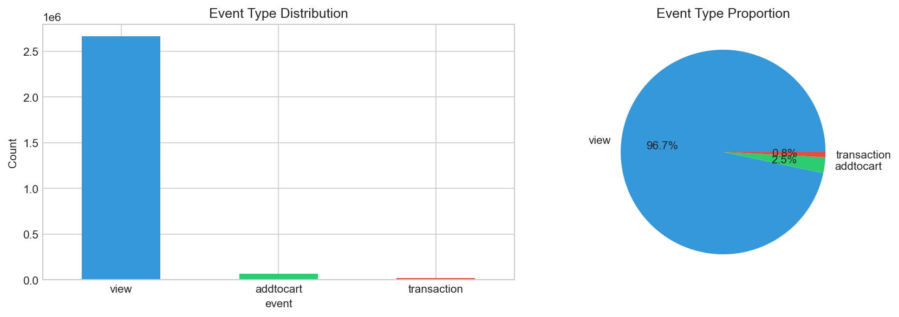
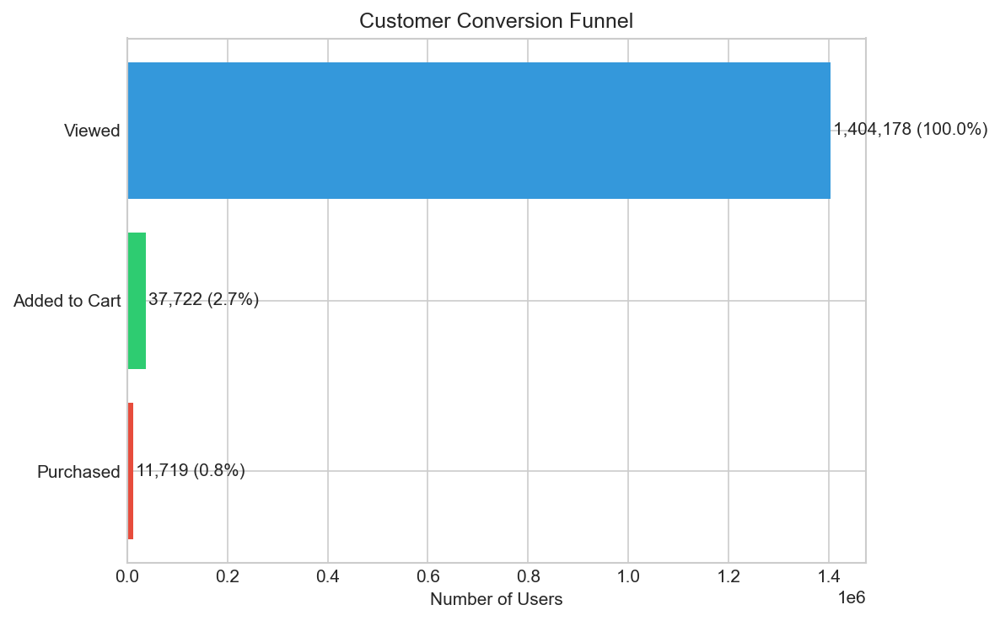
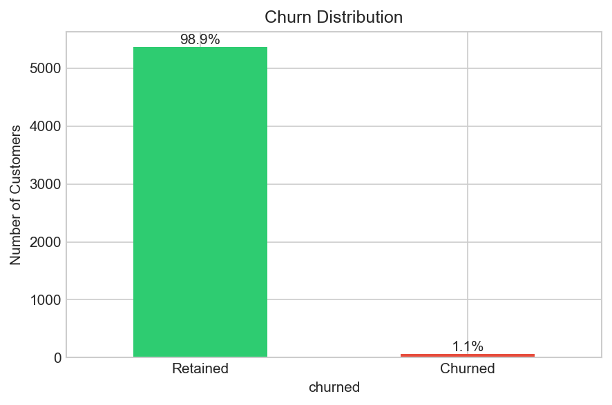
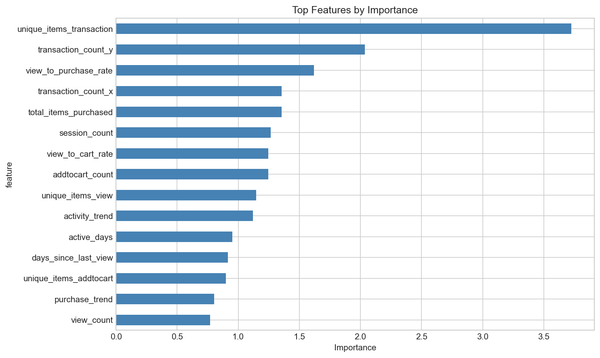

# Exploratory Data Analysis — RetailRocket

This is the analysis behind the modeling choices in the [README](../README.md). Every number here is computed from the cleaned event log (`DataLoader().load_events()`); the figures in [`../figures/`](../figures) are the pre-rendered visuals from the same exploration.

## 1. Dataset shape

| Property | Value |
|---|---|
| Events (after cleaning) | 2,756,098 |
| Unique visitors | 1,407,579 |
| Event types | view, addtocart, transaction |
| Time span | 2015-05-03 → 2015-09-18 (≈139 active days) |
| Events per visitor (median / mean) | 1 / 2.0 |

The event mix is extremely top-heavy:

| Event | Count | Share |
|---|---|---|
| view | 2,664,309 | 96.7% |
| addtocart | 69,332 | 2.5% |
| transaction | 22,457 | 0.8% |



**Read:** this is a browse-heavy funnel. The median visitor fires a single event, so most "customers" are anonymous one-view sessions, not engaged users.

## 2. The conversion funnel

| Step | Rate |
|---|---|
| view → add-to-cart | 2.60% |
| add-to-cart → transaction | 32.4% |
| view → transaction | 0.84% |



**Read:** the leak is at the top (view → cart). Once an item is in the cart, roughly a third convert — so cart activity is a much stronger purchase signal than raw views. This is why the engineered features separate `addtocart` recency/counts from `view` recency/counts.

## 3. Why churn is ~99%: almost nobody buys twice

This is the single most important finding for the modeling task.

- Only **11,719 visitors (0.83%)** ever transact at all.
- Of those buyers, only **1,063 (9.1%)** ever place more than one order across the entire 4.5-month window.

So when churn is defined as "an active buyer makes **no** purchase in the next 30 days," nearly everyone qualifies as churned. Tightening the activity threshold barely helps:

| Cohort definition (min transactions in observation window) | Cohort size | Churn rate |
|---|---|---|
| ≥ 1 | 5,429 | 98.9% |
| ≥ 2 | 1,177 | 96.9% |
| ≥ 3 | 493 | 93.5% |
| ≥ 5 | 184 | 85.9% |



**Read:** the target is near-degenerate. There is no `min_txns` setting that yields both a balanced target and a usable cohort size on this dataset.

## 4. What predicts the rare returning customer

Training the model (`make train`) and reading `models/feature_importance.csv`, the top predictors by gain are:

| Rank | Feature | Meaning |
|---|---|---|
| 1 | days_view | days since last product view |
| 2 | fav_item_visits | visits to the most-viewed item |
| 3 | view_count | number of product views |
| 4 | active_days | distinct days with activity |
| 5 | session_count | number of browsing sessions |



**Read:** browsing recency and intensity dominate — `days_view` leads by a wide margin, followed by view counts, active days, and sessions. Because purchases are so rare, the model leans on *viewing* behavior, not purchase history, to predict who returns. Monetary-proxy and trend features contribute far less.

## 5. Modeling implications

1. **Lift is capped by the base rate.** With ~99% churn, even a perfect ranker cannot beat the base rate by much: precision@10% ≈ 100% and lift@10% ≈ 1.0 *by construction*. The "spend retention budget on the risky decile" framing only produces value on a dataset where churn is, say, 10–40% — there has to be a meaningful retained majority to separate from. The ROI simulator is built to demonstrate that decision logic; on RetailRocket the honest answer is that targeting has little headroom.

2. **Regularize hard, but the simple model still wins.** The labeled cohort is ~5.4k customers with only ~1% retained (~60 positives total). An unconstrained LightGBM memorizes the training split (train AUC ≈ 1.0). An Optuna (TPE) search over a regularization-focused space (`min_child_samples`, `colsample_bytree`, L1/L2) curbs that - train AUC drops to ≈ 0.99 and test AUC rises from 0.78 to **0.83** (CV 0.865 → 0.883). It is a real gain, but the LogisticRegression baseline still generalizes best (test AUC ≈ 0.91), so on a cohort this small the linear model is the right default. Calibration (isotonic) meaningfully improves probability quality regardless (Brier 0.065 → 0.009). Held-out AUC is high-variance here (validation 0.60 vs test 0.83 on ~6 vs ~12 positives), so the cross-validated 0.88 ± 0.06 is the estimate to trust.

## Reproduce

```bash
make data     # download RetailRocket
make train    # writes models/metrics.json + feature_importance.csv
```

The summary statistics above are produced directly from `DataLoader().load_events()`; the cohort/churn table is `CustomerStateLabeler.label(events, min_txns=k)` for k in {1,2,3,5}.
